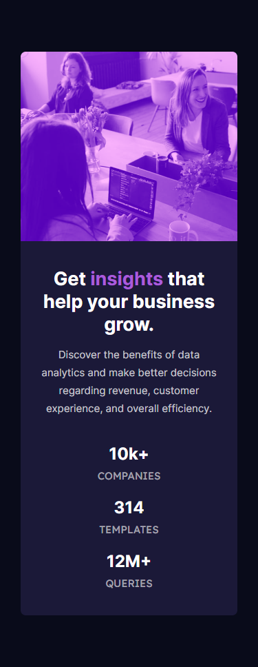

# Frontend Mentor - Stats preview card component solution

This is a solution to the [Stats preview card component challenge on Frontend Mentor](https://www.frontendmentor.io/challenges/stats-preview-card-component-8JqbgoU62). Frontend Mentor challenges help you improve your coding skills by building realistic projects.

## Table of contents

-   [Overview](#overview)
    -   [The challenge](#the-challenge)
    -   [Screenshot](#screenshot)
    -   [Links](#links)
-   [My process](#my-process)
    -   [Built with](#built-with)
-   [Author](#author)

## Overview

### The challenge

Users should be able to:

-   View the optimal layout depending on their device's screen size

### Screenshot

-   Mobile screenshot

-   Desktop screenshot

### Links

-   Solution URL: [here](https://github.com/iyefreedy/stats-preview-card-component)
-   Live Site URL: [here](https://iyefreedy.github.io/stats-preview-card-component)

## My Process

### Built with

-   Semantic HTML5 markup
-   CSS custom properties
-   Flexbox
-   Mobile-first workflow

## Author

-   Website - [freedcode.my.id](https://freedcode.my.id)
-   Frontend Mentor - [@iyefreedy](https://www.frontendmentor.io/profile/iyefreedy)
-   Twitter - [@iyefredickson](https://www.twitter.com/iyefredickson)
-   Instagram - [iyefredickson](https://www.instagram.com/iyefredickson)
-   LinkedIn - [Muhammad Quraisy](https://www.linkedin.com/in/quraisy)
